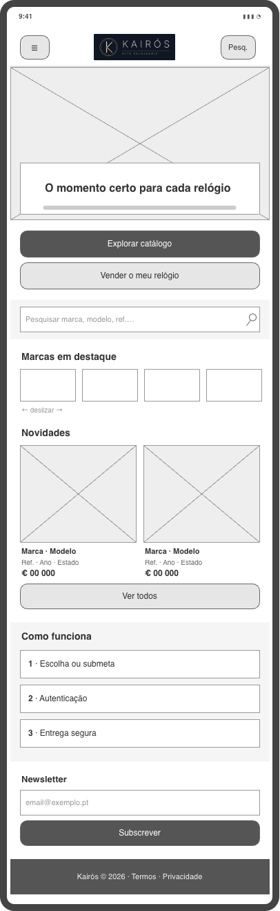
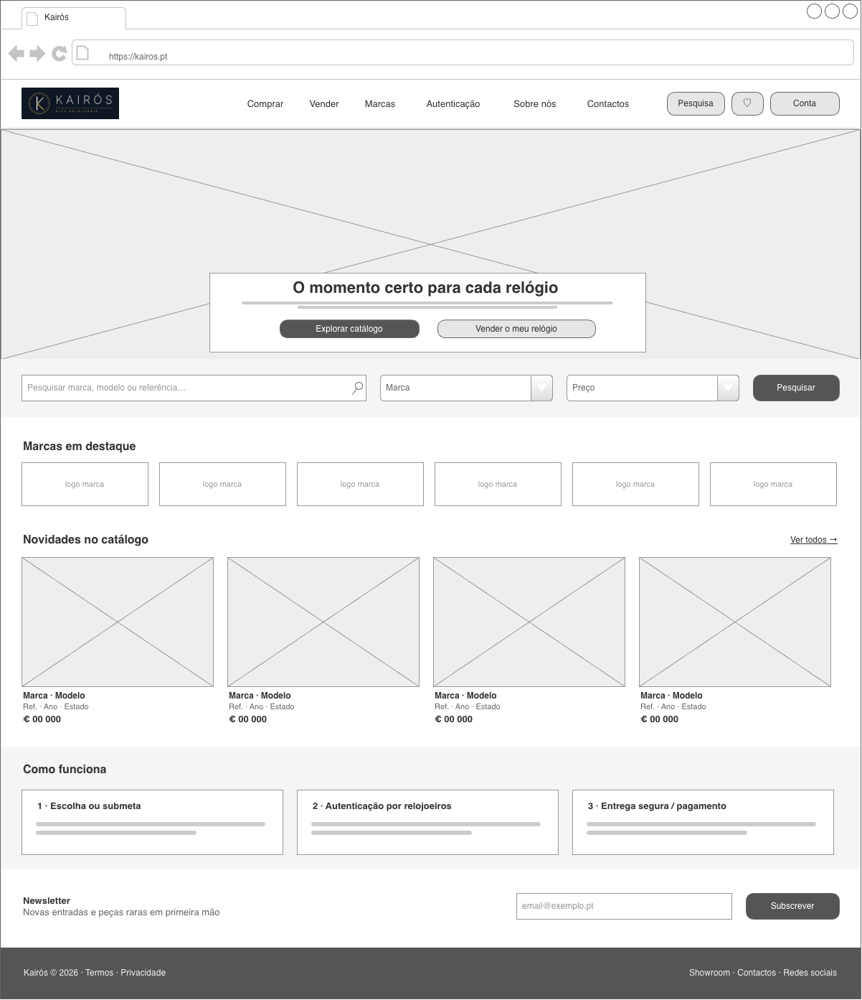
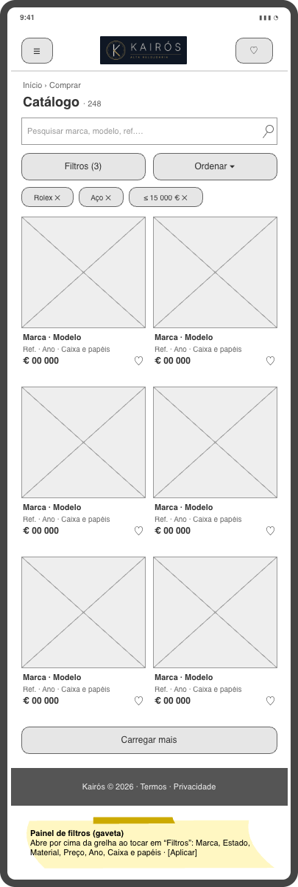
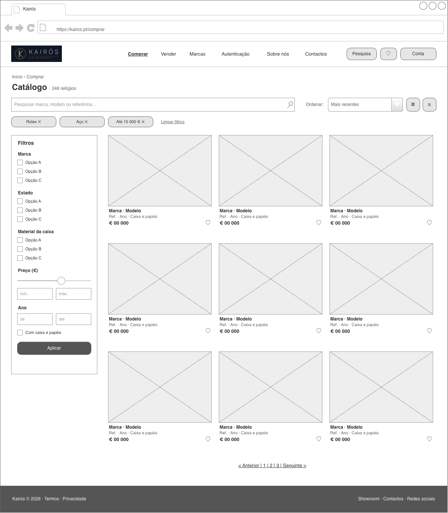

# Kairós — Alta Relojoaria


> **Desenvolvimento para a Web** · Licenciatura em Ciência de Dados para a Gestão · 2026/2027

Entrega 1: Identificação do projeto

## 1. Grupo

- Gonçalo Pais: 2024132104

- Henrique Lopes: 2024142399


## 2. Projeto

**Kairós** é uma plataforma online de compra e venda de relógios de alta relojoaria em segunda mão e de colecionador.

Nasce para dar confiança a um mercado onde a autenticidade, o estado e o preço justo são difíceis de verificar: cada relógio é inspecionado e autenticado por relojoeiros antes de ser publicado, com ficha técnica completa, fotografias reais e histórico.

O nome vem do grego *kairós*, que significa, "o momento certo" , a ideia de que cada relógio tem o seu momento para mudar de pulso.

## 3. Estrutura do website


```
Menu: Início | Comprar | Vender | Marcas | Autenticação | Sobre nós | Contactos

Início .................. destaques, novidades e pesquisa
 ├── Comprar ............ grelha de relógios com filtros
 │    └── Detalhe ....... fotos, ficha técnica e preço
 ├── Vender ............. formulário de avaliação
 ├── Marcas ............. lista de marcas A–Z
 ├── Autenticação ....... processo e garantia
 ├── Sobre nós .......... história e equipa
 ├── Contactos .......... morada, mapa e formulário
 └── Conta .............. login, favoritos e propostas
```

## 4. Conteúdos / funcionalidades

### Básicos

- **Páginas responsivas** (mobile, tablet, desktop) com menu adaptável e navegação comum a todo o site.
- **Catálogo** de relógios gerado a partir de dados (JSON), com pesquisa por texto, filtros e ordenação.
- **Página de detalhe** de cada relógio: galeria, ficha técnica, estado, preço e contacto.
- **Formulário "Vender"** com validação dos campos e envio de fotografias.
- **Página de contactos** com formulário validado e mapa incorporado.
- **Páginas informativas:** Marcas, Autenticação e Sobre nós.

### Extras

- **Conta de utilizador** (registo/login) com lista de favoritos.
- **Propostas de preço** ao vendedor e área "Os meus anúncios".
- **Comparador** de dois ou três relógios lado a lado.
- **Carrinho e checkout** simulado com reserva do relógio.
- **Conversor de moeda** (EUR/USD/CHF) e versão PT/EN.
- **Modo escuro** e alertas por email para novas entradas de um modelo.

## 5. Esquemas


Feitos no [draw.io](https://app.diagrams.net) com a biblioteca de formas **Mockup**.
Ficheiro editável: [`Mockup/kairos-esquemas.drawio`](Mockup/kairos-esquemas.drawio) (4 separadores).

### Página inicial · Mobile

Menu (☰), logótipo e pesquisa; imagem de destaque com "Explorar catálogo" e "Vender o meu relógio"; pesquisa; marcas em destaque (deslizante); novidades em 2 colunas; "Como funciona" em 3 passos; newsletter e rodapé.



### Página inicial · Desktop

Navegação completa com Pesquisa, Favoritos e Conta; destaque em largura total; pesquisa com filtros de marca e preço; 6 marcas em destaque; 4 novidades; "Como funciona" em 3 passos; newsletter e rodapé.



### Catálogo (Comprar) · Mobile

Caminho (Início › Comprar) e nº de resultados; pesquisa; botões "Filtros" (abre um painel por cima da grelha) e "Ordenar"; filtros ativos removíveis; grelha de 2 colunas com favoritos; "Carregar mais".



### Catálogo (Comprar) · Desktop

Pesquisa, ordenação e vista grelha/lista; filtros ativos removíveis; painel lateral de filtros (marca, estado, material, preço, ano, caixa e papéis); grelha de 3×3 relógios com favoritos; paginação.



## 6. Referências

- [Chrono24](https://www.chrono24.pt) — maior marketplace de relógios; referência para filtros detalhados e ficha técnica.
- [Watchfinder & Co.](https://www.watchfinder.co.uk) — fluxo de venda com avaliação e destaque dado à autenticação.
- [The 1916 Company](https://www.the1916company.com) — apresentação premium do catálogo e página de detalhe.
- [Bob's Watches](https://www.bobswatches.com) — transparência de preços e comparação de compra/venda.
- [Hodinkee](https://www.hodinkee.com) — tipografia, fotografia e tom editorial do segmento de luxo.

## Organização do repositório

- `README.md` — esta página
- `assets/kairos-logotipo.png` — logótipo
- `Mockup/kairos-esquemas.drawio` — esquemas editáveis (draw.io)
- `Mockup/*.png` — esquemas exportados (início e catálogo, mobile e desktop)
